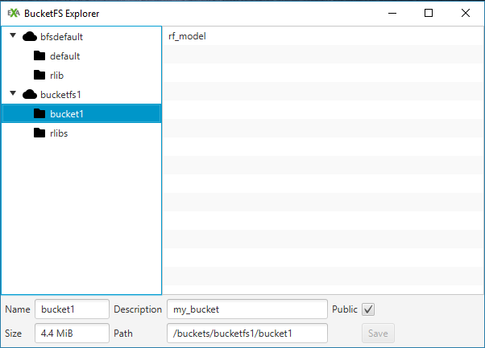

Train and predict via UDFs
================
Exasol
March 1st, 2018

-   [Train locally, predict in Exasol](#train-locally-predict-in-exasol)
    -   [Send model to BucketFS](#send-model-to-bucketfs)
    -   [Send data to Exasol](#send-data-to-exasol)
    -   [Make prediction using UDF](#make-prediction-using-udf)
-   [Train and predict in EXASOL](#train-and-predict-in-exasol)
-   [Bonus: Predict via UDF in EXAPlus](#bonus-predict-via-udf-in-exaplus)

The following demo illustrates how to use R and Exasol, both as standalone tools and combined, to run a machine learning algorithm such as Random Forests (RF) on some data. A central feature is the use of Exasol R package and especially Exasol's user defined functions (UDFs).

> UDF scripts provide you with the ability to program your own analyses, processing or generation functions and execute them in parallel inside Exasol's high performance cluster. See [Exasol User Manual](https://www.exasol.com/portal/display/DOC/User+Manual+6.0?preview=/20056178/22521581/EXASOL_User_Manual-6.0.5-en.pdf) for more information.

UDF scripts play a pivotal role and provide the user with a flexible interface for implementing every requirement by integrating Java, Lua, Python and R language to Exasol native environment. However, Exasol ecosystem is not the only place we can make use of UDFs. Exasol R package also allows for the use of UDFs via `exa.createScript()` function which deploys R code dynamically from any R environment into Exasol database in parallel. See `?exa.createScript` for more information.

The typical (supervised) learning process starts with training a model on some sample training data. Then, the trained model can be used to make predictions on separate (unseen) test data. The data in our case consists of housing data from the [Boston Housing](https://archive.ics.uci.edu/ml/machine-learning-databases/housing/) dataset. This will be a regression exercise since the response variable we are trying to predict is a continuous one, the median value of housing `medv`.

Requirements:

-   [R programming language](https://www.r-project.org/)
-   [RStudio](https://www.rstudio.com/)
-   [Exasol R package](https://github.com/EXASOL/r-exasol) (see *Exasol R Package Guide*)
-   [Exasol Community Edition](https://www.exasol.com/portal/display/DOWNLOAD/Free+Trial) (see *Install Exasol Community Edition Guide*)
-   [EXAPlus](https://www.exasol.com/portal/display/DOWNLOAD/Version+6.0.5) (see *Install Exasol Community Edition Guide*)
-   ODBC and [Exasol ODBC Driver](https://www.exasol.com/portal/display/DOWNLOAD/Version+6.0.5) (see *Install Exasol Community Edition Guide*)
-   [BucketFS Explorer](https://github.com/EXASOL/bucketfs-explorer) (see *BucketFS Guide*)

Conventionally, one would load the data from a local machine into R or RStudio. Then, you would run the analysis by training the model, evaluating and making predictions in such environment. However, we want to make use of Exasol database and this opens up the possibility of two additional scenarios:

-   Train locally and make predictions in Exasol
-   Train and make predictions in Exasol

Train locally, predict in Exasol
================================

We start by loading the data in R. The Boston Housing dataset is available through the `mlbench` package.

``` r
# load libraries
library(mlbench)         # Load data
library(RODBC)           # ODBC database connectivity
library(exasol)          # R interface for Exasol database
library(randomForest)    # Random forests for regression and classification
library(RCurl)           # HTTP communication
```

After loading the data in our environment we will make a split for training and testing sets. This can be done in many ways but one way is to randomly generate indices that will subset rows from the main set. The ratio of the split is arbitrary and depends on data and application at hand. In this simple case will hold roughly 75% of the data for training and the other 25% for testing purposes.

``` r
# Load data
data("BostonHousing")

# Generate random indices (75% of the sample size)
set.seed(42)
indices <- sample(nrow(BostonHousing),size=floor(nrow(BostonHousing) * 0.75))

# Add a dummy variable with 2 levels "Train" and "Test" 
BostonHousing$split = factor(NA, levels = c("Train", "Test"))

# Assign predefined rows respectively to "Train" and "Test" subsets
BostonHousing$split[indices]  = "Train"
BostonHousing$split[-indices] = "Test"

# Add id variable 
BostonHousing$id = seq(1:nrow(BostonHousing))
```

Now we can train a basic random forest model on our data and see which variables contribute the most to predicting the median house value.

``` r
set.seed(42)
# Run model (note that we filter only for the training data (split=="Train"))
rf_model = randomForest(medv ~ .-split -id,
                        data = BostonHousing[BostonHousing$split=="Train",],
                        importance = TRUE)

# See which variables are important in predicting house prices
varImpPlot(rf_model)
# rm    - number of rooms per house
# lstat - % lower status of the population
```


Send model to BucketFS
----------------------

UDF scripts are executed in parallel on the Exasol cluster and in our case for the prediction such script needs to have access to the model we just trained. While it is possible to use any file service, when considering performance it is more efficient to have a storage space in the local cluster nodes. Keep in mind that the Exasol database cluster stores only tables and we cannot simply upload our model in there. The *Exasol BucketFS* file system has been created to handle such needs.

> The Exasol BucketFS file system has been developed for such use cases, where data should be stored synchronously and replicated across the cluster... this concept can be used to extend script languages and even to install completely new script languages on the Exasol cluster. [Exasol User Manual](https://www.exasol.com/portal/display/DOC/User+Manual+6.0?preview=/20056178/22521581/EXASOL_User_Manual-6.0.5-en.pdf)

Files can be sent and retrieved from BucketFS in the following ways:

-   Using packages that allow HTTP communication in R (`httr` or `RCurl`)
-   [BucketFS Explorer](https://github.com/EXASOL/bucketfs-explorer) (drag and drop tool provided by Exasol)
-   Using `curl` commands (will not be shown here)

With the first method we will use the `RCurl` package. It is important to note that the model which lives in our R environment now has to be serialized (converted into raw text). When we want to retrieve it we can unserialize it and return it to its original filetype. See `?serialize` for more information.

``` r
# Define options for the authentication
curl_opts = curlOptions(userpwd  = "w:admin",
                        verbose  = FALSE,
                        httpauth = AUTH_BASIC)

# Transfer model to the bucket
httpPUT(
  # EXABucket URL
  url = "http://192.168.56.102:8080/bucket1/rf_model",
  # It is important to serialize the model
  content = serialize(rf_model, ascii = FALSE, connection = NULL),
  # EXABucket: authenticate 
  curl = getCurlHandle(.opts = curl_opts)
)
```

In cases when the size of you model becomes an issue, it is worth checking the [Strip](https://cran.r-project.org/web/packages/strip/strip.pdf) package which allows you to reduce the memory footprint of your models.

We can open BucketFS Explorer and see that the file is transferred to bucket1.



We could also save the model locally and then just drag and drop it into the bucket. BucketFS and BucketFS Explorer functionalities are covered more in-depth in the *BucketFS Guide*.

Send data to Exasol
-------------------

In order to run the prediction in Exasol we need to transfer the data into the database. We have seen in the *Exasol R Package Guide* how to write and read data in and from the Exasol cluster.

``` r
# Create connection with the EXASOL database
exaconn <- dbConnect(
    drv     = "exa",                  # EXAdriver object
    exahost = "192.168.56.102:8563",  # IP of database cluster
    uid     = "sys",                  # Username
    pwd     = "exasol")               # Password
    
# Create database schema with the name bh_schema 
odbcQuery(exaconn, "CREATE SCHEMA bh_schema")

# Make the new schema the default one for the subsequent operations
odbcQuery(exaconn, "OPEN SCHEMA bh_schema")

# Create an empty table in EXASOL with the name boston_housing
odbcQuery(exaconn,
    "CREATE OR REPLACE TABLE BostonHousing(
         crim    DOUBLE, 
         zn      DOUBLE, 
         indus   DOUBLE, 
         chas    VARCHAR(10),
         nox     DOUBLE, 
         rm      DOUBLE, 
         age     DOUBLE,
         dis     DOUBLE,
         rad     DOUBLE,
         tax     DOUBLE,
         ptratio DOUBLE,
         b       DOUBLE,
         lstat   DOUBLE,
         medv    DOUBLE,
         split   VARCHAR(10),
         id      INT
     )")

# Write the train data into Exasol
exa.writeData(exaconn, data = BostonHousing, tableName = "BostonHousing")
```

We can see via EXAPlus that the data is transferred to the database with the corresponding schema.


Make prediction using UDF
-------------------------

We are now ready to use the algorithm which is in BucketFS to run a prediction on the data which is in Exasol. For this we will use a UDF and in R this is achieved by `exa.createScript` function.

``` r
PredictInExasol <- exa.createScript(
  exaconn,
  "bh_schema.dt_predict1",
  function(data) {
    
    # Load the required packages
    require(RCurl)
    require(randomForest)
    
    # Load data in chuks of 1000 rows at a time (very useful knob with big data!)
    repeat {
      if (!data$next_row(1000))
        break

      # put data in a data.frame
      df <- data.frame(
              id       = data$id,
              crim     = data$crim,
              zn       = data$zn,
              indus    = data$indus,
              chas     = data$chas,
              nox      = data$nox,
              rm       = data$rm,
              age      = data$age,
              dis      = data$dis,
              rad      = data$rad,
              tax      = data$tax,
              ptratio  = data$ptratio,
              b        = data$b,
              lstat    = data$lstat,
              medv     = data$medv,
              split    = data$split
            )
    }
    
    # Set options for retrieving model from bucket
    curl_opts = curlOptions(userpwd = "w:exasol",
                            verbose = TRUE,
                            httpauth=AUTH_BASIC)
                            
    # Loading the model from the bucket (note that is unserialized)
    rf_model = unserialize(httpGET(url  = "http://192.168.56.102:8080/bucket1/rf_model",
                                   curl = getCurlHandle(.opts = curl_opts)))
    
    # Use the loaded model to make the prediction
    prediction <- predict(rf_model, newdata = df)
    
    # Return of the forecast
    data$emit(df$id, df$medv, prediction)
  },
  
  # Input arguments
  inArgs  = c("id         INT",
              "crim       DOUBLE", 
              "zn         DOUBLE", 
              "indus      DOUBLE", 
              "chas       VARCHAR(10)",
              "nox        DOUBLE", 
              "rm         DOUBLE", 
              "age        DOUBLE",
              "dis        DOUBLE",
              "rad        DOUBLE",
              "tax        DOUBLE",
              "ptratio    DOUBLE",
              "b          DOUBLE",
              "lstat      DOUBLE",
              "medv       DOUBLE",
              "split      VARCHAR(10)"),
             
  # Output arguments
  outArgs = c("id         INT",
              "RealValue  DOUBLE",
              "Prediction DOUBLE")
)

# Create a table with the real values and predicted ones
# Note that the prediction is done in test data using 'where' argument
prediction_output = PredictInExasol("id","crim", "zn", "indus", "chas", "nox", "rm", "age", "dis",
                                    "rad", "tax", "ptratio", "b", "lstat", "medv", "split",
                                    table = "bh_schema.BostonHousing",
                                    where = "split = 'Test'")  

# Check the root mean squared error (RMSE)
RMSE = sqrt(mean((prediction_output$PREDICTION - prediction_output$REALVALUE)^2))
# Should be 3.35
```

We can also plot our predicted values and see the fit:

``` r
# Plot the predictions against real values
library(ggplot2)

plot_predictions = ggplot(prediction_output, aes(ID)) + 
                    geom_line(aes(y = PREDICTION, colour = "Prediction")) + 
                    geom_line(aes(y = REALVALUE, colour = "True Value")) +
                    xlab("") +
                    ylab("Results") + 
                    ggtitle("Predicted vs Real values")
                    theme(legend.title=element_blank())
                    
plot(plot_predictions)
```


Train and predict in EXASOL
===========================

We will now make use of the UDF to train our model within the EXASOL cluster. Inside the UDF we read the data from the database into a `data.frame` object which we use to run the model. We then send this model to BucketFS for future usage and return some model information (variable importance in this case).

``` r
TrainInExasol2 <- exa.createScript(
  exaconn, 
  "bh_schema.dt_train2", 
  function(data) {
    
    # Load the required packages
    library(randomForest)
    library(RCurl)
    
    # Load data in chuks of 1000 rows at a time (very useful knob with big data!)
    repeat{
        if (!data$next_row(1000))
            break
    
      # Transform into data frame
      df <- data.frame(
              id       = data$id,
              crim     = data$crim,
              zn       = data$zn,
              indus    = data$indus,
              chas     = data$chas,
              nox      = data$nox,
              rm       = data$rm,
              age      = data$age,
              dis      = data$dis,
              rad      = data$rad,
              tax      = data$tax,
              ptratio  = data$ptratio,
              b        = data$b,
              lstat    = data$lstat,
              medv     = data$medv,
              split    = data$split
            )
    }
    
    # Run random forest
    set.seed(42)
    rf_model2 <- randomForest(medv ~ .-id -split,
                              data = df[df$split=="Train",],
                              importance = TRUE)
    
    curl_opts = curlOptions(userpwd  = "w:exasol",
                            verbose  = TRUE,
                            httpauth = AUTH_BASIC)
    RCurl:::httpPUT(
      url     = "http://192.168.56.102:8080/bucket1/rf_model2",
      content = serialize(rf_model2, ascii = FALSE, connection = NULL),
      curl    = getCurlHandle(.opts = curl_opts)
    )
    
    # Return the line number 
    data$emit(rownames(rf_model2$importance),
              unname(rf_model2$importance[,1]),
              unname(rf_model2$importance[,2]))
  },
  
  # Input arguments
  inArgs  = c("id         INT",
              "crim       DOUBLE", 
              "zn         DOUBLE", 
              "indus      DOUBLE", 
              "chas       VARCHAR(10)",
              "nox        DOUBLE", 
              "rm         DOUBLE", 
              "age        DOUBLE",
              "dis        DOUBLE",
              "rad        DOUBLE",
              "tax        DOUBLE",
              "ptratio    DOUBLE",
              "b          DOUBLE",
              "lstat      DOUBLE",
              "medv       DOUBLE",
              "split      VARCHAR(10)"),
             
  # Output arguments
  outArgs = c("Variable   CHAR(20)",
              "MSE        DOUBLE",
              "NodePurity DOUBLE")
)

#Call of the function. The return is stored in an object   
variable_importance = TrainInExasol2("id","crim", "zn", "indus", "chas", "nox", "rm", "age", "dis",
                                     "rad", "tax", "ptratio", "b", "lstat", "medv", "split",
                                     table = "bh_schema.BostonHousing",
                                     where = "split = 'Train'")
```

Now that we have model, `rf_model2`, stored in BucketFS we will use it to make predictions on our test data which lives in the EXASOL database. The testing procedure is the same as in the scenario above.

``` r
# Create UDF for prediction
PredictInExasol2 <- exa.createScript(
  exaconn,
  "bh_schema.dt_predict2",
  function(data) {
    
    # Load the required packages
    require(RCurl)
    require(randomForest)
    
    # Load data in chuks of 1000 rows at a time (very useful knob with big data!)
    repeat{
        if (!data$next_row(1000))
            break

      # Load the data into a data.frame
      df <- data.frame(id       = data$id,
                       crim     = data$crim,
                       zn       = data$zn,
                       indus    = data$indus,
                       chas     = data$chas,
                       nox      = data$nox,
                       rm       = data$rm,
                       age      = data$age,
                       dis      = data$dis,
                       rad      = data$rad,
                       tax      = data$tax,
                       ptratio  = data$ptratio,
                       b        = data$b,
                       lstat    = data$lstat,
                       medv     = data$medv,
                       split    = data$split)
    }
    
    # Set options for retrieving model from bucket
    curl_opts = curlOptions(userpwd  = "w:exasol",
                            verbose  = TRUE,
                            httpauth = AUTH_BASIC)
    
    # Load the model from the bucket (note that is unserialized)
    rf_model2 = unserialize(httpGET(url = "http://192.168.56.102:8080/bucket1/rf_model2",
                                   curl = getCurlHandle(.opts = curl_opts)))
    
    # Use the loaded model to make the prediction
    prediction <- predict(rf_model2, newdata = df)
    
    # Return the forecast
    data$emit(df$id, df$medv, prediction)
  },
  
  # iInput arguments
  inArgs  = c("id         INT",
              "crim       DOUBLE", 
              "zn         DOUBLE", 
              "indus      DOUBLE", 
              "chas       VARCHAR(10)",
              "nox        DOUBLE", 
              "rm         DOUBLE", 
              "age        DOUBLE",
              "dis        DOUBLE",
              "rad        DOUBLE",
              "tax        DOUBLE",
              "ptratio    DOUBLE",
              "b          DOUBLE",
              "lstat      DOUBLE",
              "medv       DOUBLE",
              "split      VARCHAR(10)"),
              
  # Output arguments
  outArgs = c("id         INT",
              "RealValue  DOUBLE",
              "Prediction DOUBLE")
)

# Create a table with the real values and predicted ones
prediction_output2 = PredictInExasol2("id","crim", "zn", "indus", "chas", "nox", "rm", "age", "dis",
                                      "rad", "tax", "ptratio", "b", "lstat", "medv", "split",
                                      table = "bh_schema.BostonHousing",
                                      where = "split = 'Test'")

# Check the root mean squared error (RMSE)
RMSE = sqrt(mean((prediction_output2$PREDICTION - prediction_output2$REALVALUE)^2))
# 3.35, similar to the one above
```

Bonus: Predict via UDF in EXAPlus
=================================

We can run the same exact prediction model from Exasol native environment in EXAPlus. The model can be deployed using a UDF which dynamically executes R code. Much is the same as above, except for the way we get the data from the database via the context object `ctx`. See detailed information in [Exasol User Manual](https://www.exasol.com/portal/display/DOC/User+Manual+6.0?preview=/20056178/22521581/EXASOL_User_Manual-6.0.5-en.pdf).

``` sql
-- 1. Create prediction function
CREATE OR REPLACE R SET SCRIPT bh_schema.predict3(...) EMITS (id INT, RealValue DOUBLE, Prediction DOUBLE) AS

# Load library
library(randomForest)

# Get number of columns
numCols <- exa$meta$input_column_count

# Create empty list with length numCols
l = vector("list", numCols)

run <- function(ctx) {
 
  # Load the model from the bucket 
  rf_model = readRDS("/buckets/bucketfs1/bucket1/rf_model")
  
  # ...or depending on the file type
  #load("/buckets/bucketfs1/bucket1/rf_model.dat")

  # Split input into modest sized chunks, this can be adjusted for memory consumption
  repeat{
    if (!ctx$next_row(1000000))
        break 
  
  # Populate list with data columns
  for (i in 1:numCols){
  
        l[[i]] <- ctx[[i]]()
  
  }

  # Convert to data.frame for modelling
  df = as.data.frame(l)

  # Set the column names
 
  # From the model object, note: model/scenario specific
  # the_colnames <- names(rf_model$forest$xlevels)
  # colnames(df) = the_colnames

  # Assign manually, note: not dynamic
  # Note: case sensitive when using double quotes 
  colnames(df) <- c("id", "crim", "zn", "indus", "chas", "nox", "rm", 
  "age", "dis", "rad", "tax", "ptratio", "b", "lstat", "medv", "split")
  
  # Get predictions
  prediction   <- predict(rf_model, newdata = df)

  # Output ids, real values and predicted ones
  ctx$emit(df$id, df$medv, prediction)
  }
}
/

-- 2. Run prediction function
SELECT bh_schema.predict3(id,crim, zn, indus, chas, nox, rm, age, dis, rad, tax, ptratio, b, lstat, medv, split)
FROM   bh_schema.bostonhousing
WHERE  split = 'Test'
GROUP by iproc()
ORDER  BY id
MOD(ROWNUMBER,32);
```

Note that the UDFs we created are saved in your schema and can be accessed via EXAPlus.


Next: [Install additional R packages in Exasol](05_install_additional_r_packages.md)
