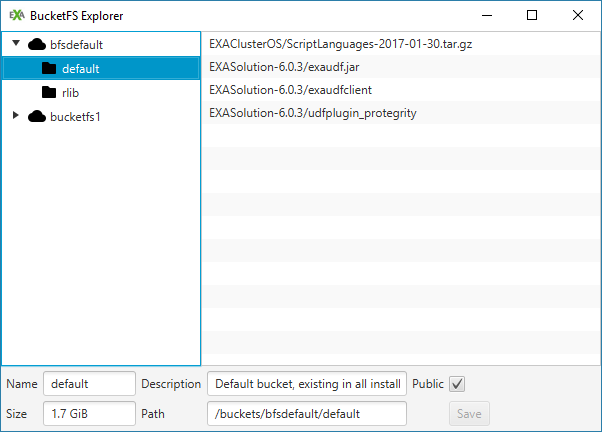
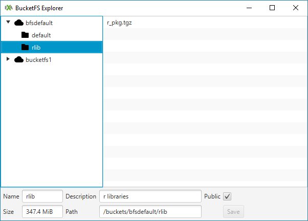

Install additional R packages in Exasol
================
Exasol
November 15th, 2018

-   [Build the container from scratch](#build-the-container-from-scratch)
-   [Extend the existing default container](#extend-the-existing-default-container)
    -   [Import into Docker](#import-into-docker)
    -   [Install new package(s)](#install-new-packages)
    -   [Send to BucketFS](#send-to-bucketfs)

In this demo we will show how to expand the existing languages in Exasol, specifically R. In Exasol we can use UDFs to implement many extensions such as scalar functions, aggregate functions, MapReduce algorithms, ETL processes and analytical functions. We can run our analysis in R and other built-in languages (Python, Lua, Java) via UDFs. However, in most cases during our analysis in R, we need to make use of various packages not included in the base R version or in the R version that Exasol provides. To install new packages in Exasol we must take some specific steps.

Requirements:

-   [Exasol Community Edition](https://www.exasol.com/portal/display/DOWNLOAD/Free+Trial) (see *Install Exasol Community Edition Guide*)
-   [EXAPlus](https://www.exasol.com/portal/display/DOWNLOAD/Version+6.0.5) (see *Install Exasol Community Edition Guide*)
-   ODBC and [Exasol ODBC Driver](https://www.exasol.com/portal/display/DOWNLOAD/Version+6.0.5) (see *Install Exasol Community Edition Guide*)
-   [BucketFS Explorer](https://github.com/EXASOL/bucketfs-explorer) (see *BucketFS Guide*)
-   [Docker](https://www.docker.com/)
-   A [git](https://git-scm.com/download/) or [GitHub](https://desktop.github.com/) client

From the [Exasol User Manual](https://www.exasol.com/portal/display/DOC/User+Manual+6.0?preview=/20056178/22521581/EXASOL_User_Manual-6.0.5-en.pdf):

> The installation of R packages is a bit more complex because they have to be compiled using the C compiler. To manage that, you can download the existing Exasol Linux container, compile the package in that container and upload the resulting package into BucketFS.

Before going through the steps and methods, it is important to understand how and where default built-in script languages can be accessed in EXASOL. The answer to both questions is BucketFS.

If you open BucketFS Explorer, you can see in `/buckets/bfsdefault/default` that there is among others a zip file called `EXAClusterOS/ScriptLanguages-2017-01-30.tar.gz`. This is where all the default script languages are compiled and each time we run a UDF, it is directly linked to this directory and makes use of it. The date shows the last time it was compiled and created.



Our main goal is to add further packages to the already compiled ones. There are two ways to do this:

-   Build a newly compiled `ScriptLanguages` zipfile (use for building a full stack of R packages - overall the best method)
-   Extend the existing one (use for installing few R packages without intricate dependencies - limited)

In both cases we will use Docker to build Linux containers, compile everything and export into a zip file. For more info on Docker containers see <https://www.docker.com/what-container>.

Build the container from scratch
================================

In order to the build the Linux container from scratch, we follow these steps:

1.  Clone the following Github repository

    ``` bash
    git clone https://github.com/EXASOL/script-languages.git
    ```
2. Choose a flavor. Currently we have the following available: `mini`, `standard`, `conda`, `fancyr`,`python3`,`tensorflow`,`streaming`.
This project support different versions of script language environments with different sets of libraries and languages.
We call these versions _flavors_ for no particular reason.
Each flavor has its own set of build-files in a corresponding subfolder of [dockerfiles](dockerfiles).

3.  In a text editor open the `Dockerfile` found in `<github-root>/script-languages/flavors/{flavor}/DockerFile. This file contains a set of Linux commands which are used to create the container. When we build and run the container, it will maintain the Linux version and all the libraries specified here. So we now make sure that our new R package is added to it. To do this we add the following command after line 23:
```
        libcurl4-openssl-dev \
```
and the following after line 125:
```
       RUN Rscript -e 'install.packages("caret",repos = ""http://cran.r-project.org"")' && \
```
This will install the latest release of the `caret` package as found on [CRAN](https://cran.r-project.org/web/packages/caret/vignettes/caret.html). See [here](https://docs.docker.com/engine/userguide/eng-image/dockerfile_best-practices/) for more in-depth information on Dockerfiles.

4. create the language container (we choose to use the `standard` flavor which is the simplest of the currently available flavors)
```bash
$ ./build --flavor=standard_60
```
5. export it into a standalone archive
```bash
$ ./export --flavor=standard_60
```
This creates the file `standard_60.tar.gz`.

6. You can optionally run some automated tests for your flavor by using
```bash
$ ./test --flavor=standard_60
```
7. Upload this zip file into BucketFS. Create a bucket called `rlibs` in `bucketfs1` and accordingly use `/buckets/bucketfs1/rlibs` as the directory for the the upload. Make sure that you mark this new bucket as *Public readable*.  We assume the writable password `w` and the bucketname `rlibs` in a bucketfs that is running on port `8080` on machine `192.168.56.101`)
```bash
curl -v -X PUT -T standard_60.tar.gz w:w@192.168.56.101:8080/rdfs/standard_60.tar.gz
```
This new container will be used to define an extended R language in the database. We can call it `MYLANG`. For the first test this is only done for the current EXAplus session. Note that you can have multiple R environments in parallel, e.g. one for production and others for development, testing etc. The default built-in R environment is not modified at all.

We now add an example script to the database using EXAplus. Note that it’s not necessary to add a `libPath` in the beginning because the Linux container already contains the R package `caret` and all necessary libraries specified in the newly modified 'Dockerfile'. However, the first line below needs to be added at the beginning of the script. In the current session it references the new container and connects to it.

Make sure that in `EXASolution-<version>` the right version number (of your Exasol DB in the VM) is specified. Also, note that the extension `.tar.gz` should not be included.

``` sql
ALTER SESSION SET script_languages = 'PYTHON=builtin_python R=builtin_r JAVA=builtin_java MYLANG=localzmq+protobuf:///bucketfs1/rlibz/standard_60?lang=r#buckets/bfsdefault/default/EXASolution-6.0.12/exaudfclient';

CREATE OR REPLACE MYLANG SCALAR SCRIPT bh_schema.test_script ("i" DECIMAL(18,0)) RETURNS DECIMAL(18,0) AS
    
library(caret)

run <- function(ctx){
  return (1) 
}
/

-- Test the newly installed script
SELECT bh_schema.test_script(0) FROM DUAL;
```
If we want the connection to be valid in all sessions we use replace `ALTER SESSION SET …` with `ALTER SYSTEM SET …`.

This approach has certain advantages:

-   You can manage the `Dockerfile` and the `make` shell script in your local version control system (git, SVN, etc.)
-   The deployment of the Linux container can be fully automated and thus is fully reproducible.
-   It’s guaranteed that the R packages installed are also running in the database because they are delivered together with the container.
-   You can manage different R or other UDF scripting environments in the same database.

8. Afterwards you may choose to remove the docker images for this flavor
```bash
./clean --flavor=standard_60
```
Extend the existing default container
=====================================

The next steps include importing the existing `ScriptingLanguages` file into a Docker container, installing additional packages while in the container, recompiling it and sending it to BucketFS again.

Import into Docker
------------------

In a Docker terminal type the following:

``` bash
docker import http://192.168.56.101:8088/default/EXAClusterOS/ScriptLanguages-<date>.tar.gz my_dock
mkdir r_pkg
docker run -v `pwd`/r_pkg:/r_pkg --name=my_dock -it my_dock /bin/bash
```

Ensure that the correct `bfsdefault` port and the right date of the `ScriptLanguages` file is specified.

Install new package(s)
----------------------

After the last command (`docker run …`) you are now inside the container. It is our own Linux environment and we can start installing packages (`phonenumber` in our this case).

In the shell type:

``` bash
export R_LIBS="/r_pkg/"
R
```

…then in R:

``` r
install.packages('phonenumber', repos="http://cran.r-project.org")
```

…then you should see:

    Installing package into '/r_pkg'
    (as 'lib' is unspecified)
    trying URL 'http://cran.r-project.org/src/contrib/phonenumber_0.2.2.tar.gz'
    Content type 'application/x-gzip' length 10516 bytes (10 KB)
    ==================================================
    downloaded 10 KB

Note that the package is installed in our local pre-specified directory. We can install as many packages as we want. Then exit R and the Docker image.

Send to BucketFS
----------------

After the above steps we have our additional package compiled together with all other default packages in our local directory. The next step is to send this compiled file into BucketFS. We have to compress the `r_pkg` directory first and for this we can use the following command in the terminal.

``` bash
tar -czf r_pkg.tgz r_pkg
```

Now that we have a compressed file in our local directory we can just drag and drop it into Bucketfs. We add another sub-directory to the default bucket, call it `rlib` and put the zip file there.



Now the new package is ready to be used. We open EXAplus and try the following UDF. It is important to note that we need to add the new directory path (see line 2) of the new container to the default library path in R.

``` sql
CREATE OR REPLACE R SCALAR SCRIPT "TOPHONE" ("letters" VARCHAR(2000) UTF8) RETURNS VARCHAR(2000) UTF8 AS

.libPaths(c("/buckets/bfsdefault/rlib/r_pkg/r_pkg", .libPaths()))

library(phonenumber)

run <- function(ctx) {
  letterToNumber(ctx$letters, qz = 1)
}
/

SELECT tophone('1-800-EXASOL') FROM DUAL;
```

At the beginning of the UDF we add the bucket path of the newly uploaded package to the default library tree. The first `r_pkg` in the path refers to the `r_pkg.tgz` file, while the second `r_pkg` is the topmost directory in that archive where the `phonenumber` package is located.
